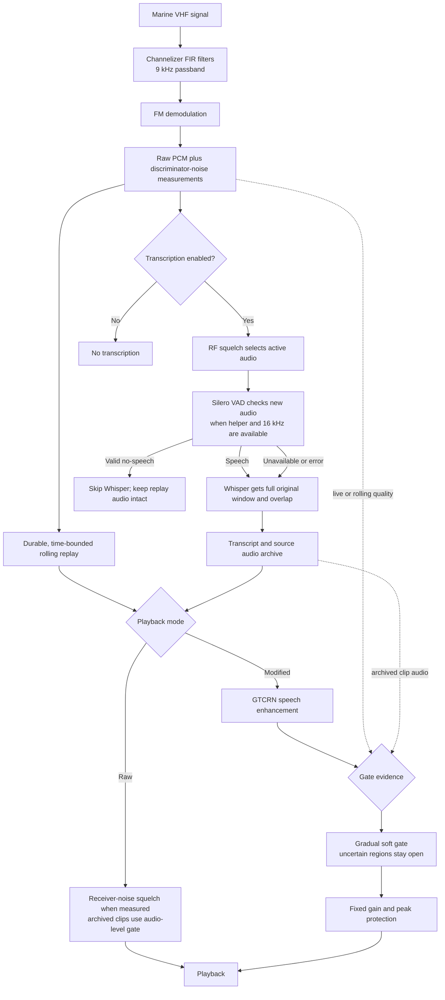

# Signal K VHF Watch

**EXPERIMENTAL**

Receive-only marine VHF monitoring for Signal K with a dedicated touch-friendly web interface,
authenticated live audio, and a private rolling replay buffer.

The default channel plan covers both the United States and Canada. The web interface can switch
between the combined plan, US-only channels from the US Coast Guard table, and Canadian channels
from the Canadian Coast Guard's current Radio Aids to Marine Navigation table. For duplex channels,
the receiver tunes the coast-station frequency that a vessel radio hears.

- US: <https://navcen.uscg.gov/us-vhf-channel-information>
- Canada: <https://www.canada.ca/en/canadian-coast-guard/corporate/publications/radio-aids-marine-navigation/foreword.html#toc3>

VHF Watch deliberately contains **no transmitter or push-to-talk implementation**. It is not a
substitute for a certified marine VHF radio or required watchkeeping equipment. Channel 70 is
continuously decoded as Digital Selective Calling data and is never offered as voice audio.

## First run without hardware

The plugin defaults to `Demo audio`. Install and enable it, then open `/signalk-vhf-watch/`. The demo
receiver generates a quiet periodic two-tone signal so the entire live/replay workflow can be tested
without radio hardware.

## RTL-SDR receiver

Install the `rtl_sdr` utility on the Signal K host, then make the SDR USB device visible to Signal K.
The npm package includes statically linked `linux-arm64` and `linux-x64` sidecars, so Go is not
required on Raspberry Pi or x86-64 Linux; the configurable sidecar path supports development builds
and future platforms. Choose `RTL-SDR
wideband` in the plugin configuration and restart the plugin. The native sidecar opens the tuner at 2.4 MS/s and performs the audio channelizers plus a sparse whole-band activity FFT;
only low-rate PCM crosses into JavaScript. Independent channelizers provide Slot A voice and either
an uninterrupted 24 kHz Channel 70 DSC decoder or Slot B voice. When Slot B carries voice, a
separate Channel 70 channelizer keeps DSC reception continuous. Changing either slot inside the
capture window does not restart or retune the hardware.

Either voice slot can remain fixed or use wideband scan. The sparse FFT observes every analog marine
channel in the 2.4 MHz capture window at once, highlights current RF activity, and sends the two
audio demodulators directly to the strongest active channels instead of hopping blindly. Channel 16
receives a small priority boost, an open voice channel is held until it goes quiet, and five seconds
of raw wideband IQ are retained in a circular ring. When the spectrum detector assigns a slot, a
bounded background worker retrospectively demodulates that channel from the IQ ring and places it
at the beginning of the ongoing recording, trimming overlap with live samples and preserving speech
that began before the assignment. Scan holds the channel through five seconds of squelched silence;
recovered and live audio share the same recording and transcription window. Short gaps in spectrum
detections are coalesced so one transmission is not shown as a burst of separate activity marks.
The two voice slots can preserve two simultaneous calls; additional collisions remain highlighted as
RF activity but cannot produce audio without another SDR or demodulation slot. Channel 70 DSC stays
continuous throughout in-band voice scanning.

The 24-hour activity timeline combines historical recordings from both voice slots and all captured
channels in chronological order. Blue spans retain bounded whole-band RF detections, green spans
identify voice captures that can be played, and amber ticks mark decoded Channel 70 DSC calls. Tapping
a voice mark starts finite recordings from that point forward; the waveform has its own play, seek, and
five-second skip controls. **Latest** jumps to the newest historical recording. **Listen live** is a
separate control for the current Slot A channel and stops when another recording starts or Slot A is
retuned. RF-only marks explicitly report that no playable voice was captured. Slot B's `70` selection
means the second voice demodulator is idle—Channel 70 remains an independent continuous decoder
regardless of either voice-slot selection.

Each native channelizer mixes its target to baseband, applies two stages of Blackman-windowed FIR
filtering and controlled decimation, and limits the final RF passband to 9 kHz before FM
discrimination. A slow residual-carrier tracker removes up to 1.5 kHz of tuner error without chasing
voice modulation. The polar discriminator is inherently amplitude-limited; an additional amplitude
normalizer would not change its phase output, so the sidecar instead suppresses only numerically
empty IQ samples. Status exposes measured carrier offsets and the fraction of ADC bytes near the
converter rails to support PPM and manual-gain tuning.

Select the tuner by its stable serial number when possible; a numeric device index is retained for
single-SDR and backward-compatible configurations. Set the receiver's measured PPM correction in
the plugin configuration. If the capture process or USB device fails, VHF Watch retries with bounded
exponential backoff. Status reports receiver restart counts and IQ chunks dropped when the
channelizer cannot keep up, so a trial can distinguish quiet RF from an unhealthy processing path.

Marine mode is centered at 156.75 MHz. Its 2.4 MHz window covers Channel 70, Channel 16, and
the 156–157.425 MHz simplex marine voice range simultaneously. A live Raspberry Pi trial sustained
the original native dual-channel DSP with more than 30× processing headroom and no RTL-SDR sample
loss. The stronger two-stage FIR path processes a 60-second, 2.4 MS/s dual-channel capture in about
19 seconds on the same Pi 5, retaining roughly 3.2× real-time headroom with under 8 MiB resident
memory before retrospective scan capture. The five-second IQ ring adds about 23 MiB of steady
memory. Retrospective jobs run one at a time and the queue is capped at two; under rapid retuning,
the active job plus queued snapshots can add up to about 69 MiB transiently, with the oldest queued
job discarded in favor of the newest. Backfill is demodulated in 20 ms slices through one continuous
channelizer, and each slice carries its own discriminator-noise measurement into replay so earlier
speech remains playable when later recovered audio is only noise. A late backfill is ignored after
the current scan call has stored a completed replay slice, and timestamped recovery from an older
scan target is discarded. Against identical NOAA IQ, the selected 9 kHz passband reduced the quiet-window PCM RMS by
about 14% while preserving speech peaks and the complete one-minute output. The discriminator
squelch scale is calibrated to this filtered noise floor; `Medium` separates the measured idle
0.31–0.34 range from the strong NOAA value near 0.05.
Duplex coast-side and weather channels around 160–162 MHz are outside that instantaneous window.
Selecting one in fixed Slot A mode switches the same SDR into single-frequency reception centered on
that channel; Slot B, scanning, and Channel 70 DSC are visibly paused until Slot A returns to a marine
channel. Monitoring a distant channel while retaining continuous DSC still requires a second SDR.

An RTL-SDR Blog V4 already used by AIS-Catcher is valid prototype hardware, but the two programs
cannot own the same USB tuner at the same time. Stop AIS-Catcher before selecting the wideband
receiver source. AIS at 161.975/162.025 MHz and Channel 70/voice near 156–157 MHz do not fit in one
instantaneous capture window. Use a second receiver when continuous AIS and marine voice/DSC are
both required.

For a controlled one-SDR trial, stop `ais-catcher.service`, enable VHF Watch, and verify its status
before listening. Reverse that order when restoring AIS: disable VHF Watch or stop Signal K's
receiver, start AIS-catcher, and verify that fresh AIS messages resume. Never run both processes
against the same tuner and treat repeated device-open failures as harmless contention.

When Signal K runs in Podman, pass the SDR through to the container, preferably by stable USB path or
device identity rather than a changing bus number. The container image must include `rtl_sdr`.

Do not connect an SDR to the same coax as a transmitting VHF with a passive tee. Use a separate
receive antenna or a marine transmit-rated active splitter with a protected and muted receiver port.

## API

All endpoints are under `/plugins/signalk-vhf-watch` and use Signal K access control.

- `GET /api/status` — receiver and buffer state
- `GET /api/channels` — supported receive channels
- `POST /api/region` — select `US_CA`, `US`, or `CA`
- `POST /api/channel` — tune the receiver; body `{ "channel": "16" }`
- `GET /api/live.wav` — private live streaming WAV
- `GET /api/dsc` — decoded Channel 70 calls (MMSI/category/position when present)
- `DELETE /api/dsc` — clear decoded calls
- `GET /api/replay` — replay segment metadata
- `GET /api/activity` — bounded whole-band RF activity events for the 24-hour timeline
- `GET /api/replay/:id.wav` — one replay segment
- `DELETE /api/replay` — clear the rolling buffer
- `DELETE /api/replay/:id` — delete one retained replay segment
- `GET /api/transcripts` — retained transcript/audio metadata
- `GET /api/transcripts/:id.wav` — play one retained transcript's audio

Replay slices are checkpointed to the plugin's private `replay-history` directory every three
seconds and restored after Signal K restarts. An orderly shutdown flushes a final snapshot; an abrupt
shutdown can lose audio recorded since the last checkpoint. Nothing is uploaded. Age expiry removes
whole audio slices from the oldest edge by wall-clock time, so short slices created by squelch or
channel changes do not reduce the configured window. A retained slice can begin up to one slice
duration before the age cutoff. The window defaults to 24 hours and can be configured from one minute
to 24 hours. Completed slices are compacted to 24 kbps mono Opus; raw PCM remains available until
Whisper finishes. The size cap defaults to 750 MiB and cannot be configured above 750 MiB; it can
evict older slices before their age limit.

The native receiver preserves low-rate unsquelched voice PCM in that bounded replay buffer together
with discriminator-noise metadata. The **Raw playback squelch** selector controls Raw playback and is
disabled while Modified is selected; Modified uses its own conservative hiss detector. The
timeline and transcript controls offer only **Raw** and **Modified**. Modified applies the pinned
streaming GTCRN speech enhancer followed by a gradual, raw-audio-driven soft gate. It uses a fixed
playback gain with transparent peak protection; it does not rewrite the saved recording or affect
Whisper. Live and rolling replay use time-local receiver quality where available; archived clips,
which do not retain per-frame receiver quality, use the raw-audio detector. The gate intentionally
leaves uncertain or short regions open, and denoising is not proof that every weak word is preserved.
Playback uses the existing automatic gate at its full configured strength. This setting does not
change speech detection or affect open regions.
Modified currently requires 16 kHz audio; if its runtime is missing, busy, or the rate is unsupported,
the player reports that condition and Raw remains available. Transcription starts from the
FIR-demodulated source and applies a 50% RNNoise mix when that runtime is available; playback cleanup
is separate. It batches the usual one-minute storage slices with a configurable overlap (two seconds
by default), so a submitted window can be longer than one minute. The durable archive keeps the
complete source recording. New archive rows show the measured
carrier-active interval plus one second before and after. Existing rows keep their saved activity
window; the complete original recording remains available through **Original WAV**.

### How audio processing reduces noise

Noise reduction starts in the receiver: two stages of FIR filtering constrain the demodulator to the
selected channel's 9 kHz passband. The receiver then stores unsquelched, demodulated PCM with
time-local discriminator-noise measurements. Keeping that source intact lets playback apply cleanup
without changing replay or archive audio.

**Raw** playback can use the operator's Raw playback squelch setting against the receiver's
discriminator-noise measurements when those measurements are available; archived clips use an
audio-level gate. **Modified** playback runs the source through the pinned streaming
GTCRN speech enhancer, then a gradual soft gate. For live and rolling replay, the gate uses receiver
quality measurements; archived clips use a detector based on the raw audio's level and spectral
shape. Short or uncertain regions remain open to reduce the chance of cutting off speech. Fixed gain
and peak protection make the result easier to hear without modifying the stored source. This is a
playback aid, so transcription continues to use the original FIR-demodulated audio.



The playback runtime is optional and is not part of the npm plugin package. To build it from this
repository on Debian arm64, run `packaging/build-vhf-playback-runtime-deb.sh /tmp/vhf-playback-deb`
from the plugin checkout, then install the generated package with
`sudo dpkg -i /tmp/vhf-playback-deb/vhf-playback-runtime_1.13.8-2_arm64.deb`. The builder verifies
the pinned runtime, converted model, upstream GTCRN source file, and complete third-party notices
before packaging. If the runtime is absent, Raw playback remains available.

### Optional local transcription

Voice transcription is **off by default** and only starts after an operator explicitly enables
**Transcribe voice** in the VHF Watch page. That choice is stored in the plugin's private data
directory and survives Signal K restarts. Disabling it stops the worker and clears its queue.

Transcription requires the separately installed `vhf-whisper-runtime` Debian package. The receiver,
DSC decoder, live audio, and replay remain fully functional without it, and the UI will refuse to
enable transcription until a Whisper CLI or server wrapper is installed. The web UI lets an operator
select separate weather and marine models and thread counts. Both routes default to Base.EN Q5_1
with two threads and two seconds of context overlap. Models reload for each recording by default;
keeping them loaded can be enabled explicitly. Weather model and thread count remain configurable
for controlled comparison. Overlap is configurable from zero to thirty seconds, up to half the
transcription window. Status shows each route and the active batch model/thread count. If a selected
model is absent, that route reports unavailable instead of silently using the other model. The
optional resident server uses loopback only.
Recognized text appears with its archived recording and in the conversation view; failed jobs show
their per-recording error in transcription status and processing details.

Tiny.EN Q5_1 is available for explicit comparison, but is not selected automatically. On one
unlabeled 60-second WX clip it was about 61% faster than Base at one thread, but its normalized
output differed by 44.6% of Base's words. That is disagreement, not an accuracy score, because no
independent weather transcript exists. On a short public JFK speech control, Base scored 0% WER
clean and 4.5% with added radio noise; Tiny scored 9.1% on both. Those controls do not establish
marine-radio accuracy. See [the ASR comparison report](experiments/CONTINUOUS_WEATHER_ASR.md) for
measurements, controls, and limits.
Timestamp-aware decoding is retained for reliable long-window alignment; the plugin strips
the timestamp labels before display. Adjacent one-minute replay slices are exposed to the timeline
while they are still growing and are combined into recognition windows. Successive windows reuse
two seconds of audio for linguistic context, then reconcile the repeated text with the preceding
result so it is not shown twice. A shorter final window runs after the channel has been quiet for six
seconds. The decode watchdog is at least 90 seconds and scales to twice the audio duration, so a full
one-minute window receives two minutes to finish. Batches that pass the configured RF squelch are
processed one at a time; audio is not uploaded. If the optional resident server is installed and
**Keep models ready between recordings** is enabled, the manager lazily keeps at most two
loopback-only workers and reuses loaded models between batches. This option is off by default and
workers stop when transcription is disabled or settings change. On the measured 60-second clip,
resident and fresh CLI inference times were nearly identical; reuse did not materially shorten that
clip. The command-line backend remains the default and is shown in status.

### Silero VAD gate during live transcription

When the optional runtime is available and the audio is 16 kHz, the one-thread Silero VAD checks each
eligible live transcription batch, excluding retained overlap, and classifies it as speech or
no-speech. A valid no-speech result skips Whisper for that batch and increments the `skipped` status
counter. Detected speech sends the full original window, including overlap, to Whisper. Missing
helpers, unsupported rates, malformed results, and helper errors fail open to Whisper. Silero
estimates speech presence; it does not identify a speaker or prove that a positive result is human
speech. RF squelch separately determines which batches are eligible for transcription. The VAD does
not trim or rewrite replay audio, and skipped batches remain playable from the rolling buffer. A
previous Pi trial using the 0.35 threshold returned no segments for four of six archived records with
prior nonempty transcripts; those transcripts were not ground-truth labels, so recall is not
established. Lower thresholds also triggered on synthetic noise and hum. The helper accepts 80 ms
speech segments and adds 200 ms of padding.

Completed batches with recognized words are stored in the plugin's private `transcript-archive/transcripts.sqlite3` database with their
channel, start/end times, duration, sample rate, RF-noise metadata, transcript, and Zstandard-
compressed WAV. Empty results and known non-speech Whisper annotations are omitted from this durable
archive. In live transcription, VAD gates Whisper only on a valid no-speech result. Audio from
skipped batches remains available in the bounded rolling replay buffer until that replay expires.
The Transcript archive section combines adjacent records on the same channel into
one transcript and one stitched recording until a channel change, missing time, or six seconds of quiet
creates a clear session break. It remains playable after a Signal K restart. Records expire after 30 days or when the complete SQLite database reaches 100 MiB,
whichever happens first; the oldest records are removed first. The database and its containing
directory are created with service-account-only permissions. This archive requires Node.js 22.15 or
newer for the built-in SQLite and Zstandard implementations.

For an ARM64 or AMD64 package built from the matching `whisper.cpp` release, run the packaging helper
on the target Debian architecture, then install the resulting file with
`apt install ./vhf-whisper-runtime_*.deb`:

```sh
packaging/build-whisper-runtime-deb.sh /path/to/whisper.cpp/build/bin /tmp \
  /path/to/whisper.cpp/models/ggml-base.en-q5_1.bin \
  /path/to/whisper.cpp/models/ggml-small.en-q5_1.bin \
  --whisper-license /path/to/whisper.cpp/LICENSE \
  --vad-model /path/to/whisper.cpp/models/ggml-silero-v6.2.0.bin
```

The runtime package includes the matching `whisper-vad-speech-segments` helper and pinned Silero VAD
model. The build checks the VAD model's SHA-256 and includes its MIT license; the model is installed
under a separate `vad/` directory and does not appear as a selectable transcription model. The
Live transcription uses the 0.35 threshold to skip Whisper only for valid no-speech results.

The measured Pi CPU, memory, thermal, speed, and sample-quality tradeoffs are recorded in
[`docs/WHISPER_BENCHMARK.md`](docs/WHISPER_BENCHMARK.md).

Accepted DSC calls are different: they survive Signal K restarts in the plugin's private data
directory. The cache is pruned by age (seven days by default), call count (100 by default), and a
hard serialized-size limit (256 KiB by default). Incomplete, unknown-format, unknown-category, or
character-error decodes are discarded rather than shown as calls.

DSC decoding follows ITU-R M.493's ten-bit character table and 1,300/2,100 Hz VHF signalling. It is
experimental and must be validated against known-good, legally obtained over-the-air IQ captures;
never generate a distress alert for testing.

To replay a demodulated DSC recording through the same decoder used by the plugin, convert it to
24 kHz, mono, signed 16-bit PCM WAV and run:

```sh
npm run build
npm run decode:dsc-wav -- /path/to/capture.wav
```

The command exits unsuccessfully when it finds no complete DSC message, making a documented capture
suitable for a manual regression check without transmitting anything.

## Development

```sh
npm install
npm test
npm pack --dry-run
```

Go is a build dependency only. The package contains Linux ARM64 and Linux x86-64 sidecars at
`bin/linux-arm64/vhf-watch-sidecar` and `bin/linux-x64/vhf-watch-sidecar`. Build them with
`CGO_ENABLED=0` for static, architecture-specific executables; run each on its target Linux
architecture before release.

The receiver, rolling buffer, HTTP API, and web UI are deliberately independent of Binnacle so this
plugin can mature before a chart-client integration is added.
